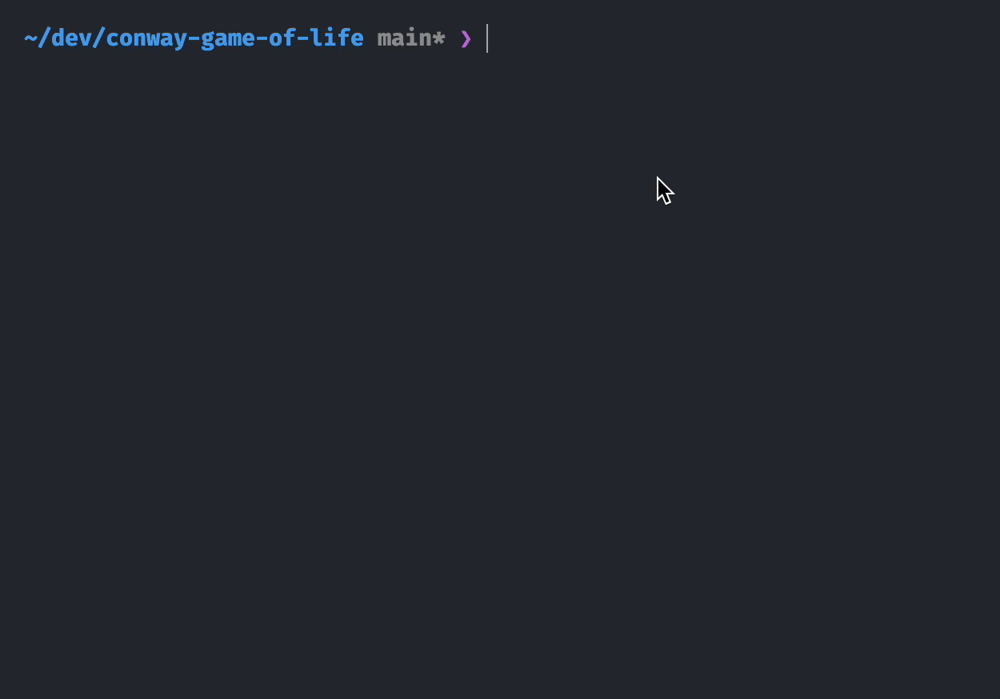

# Conway's Game of Life

This repository contains an implementation of [Conway's Game of Life](https://en.wikipedia.org/wiki/Conway%27s_Game_of_Life) in Rust.

```bash
Usage: conway-game-of-life [OPTIONS]

Options:
      --rows <ROWS>                  The number of rows of the matrix, invalid if initial_file is specified [default: 10]
      --cols <COLS>                  The number of columns of the matrix, invalid if initial_file is specified [default: 10]
      --loopback                     Whether to loop back at matrix boundaries
      --initial-file <INITIAL_FILE>  2D array json file of initial matrix state, if not set, a random matrix will be initialized
      --parallel                     whether to enable parallelism supported by rayon
      --parallel-naive               Whether to enable parallelism supported by native OS thread
      --workers <WORKERS>            Number of OS threads in parallel_naive strategy [default: 2]
  -h, --help                         Print help
  -V, --version                      Print version
```

```bash
conway-game-of-life \
  --parallel \
  --initial-file assets/oscillators/blinker.json

conway-game-of-life \
  --parallel-naive \
  --initial-file assets/oscillators/bracket-pulsar.json
```

## Demo

brack-pulsar


